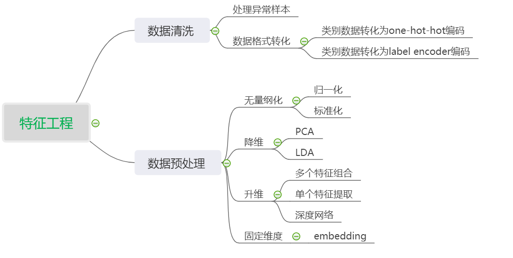

## L15 Thinking
**1.CTR数据中的类别数据处理，编码方式有哪些，区别是什么**       
LabelEncoder编码和one-hot编码。 LabelEncoder就是用一个数字编码代表一种类别。比如中国34个省级行政区域，可以用0-33来代表。但是数字3>2，而3代表的省份和2代表的省份是没有这样的比较意义，这时就可以用one-hot编码，一个34维的向量，某一位为1，其他全为0.但是在种类比较多时会很稀疏。 

**2.对于时间类型数据，处理方法有哪些**                  
最基本的就是原始的timestamp     
可以根据不同周期维度进行抽取，比如按小时分类，每天的早中晚，几时几分。也可以按照周划分，周一周五，工作日休息日。也可以按照月份，季度划分，几月，夏季冬季等。还有一些国家地区特殊节日进一步提取更多特征。

**3.你是如何理解CTR预估中的特征组合的，请举例说明**         
特征相当于输入给模型的信息，最根本的规律的都隐藏在特征的组合变化中，特征是否充分决定了预测模型的上限。比如user信息的特征组合中，用年龄和性别组合出青年男性，老年女性等等会有不同的行为特征，再加上地域特征组合，北方中年男性，北上广青年女性等等更精准的提取特征划分人群挖掘规律。又如对股票特征进行提取，不同的行业，行业所处的地位，不同的地域，市值，股价，波动率等等进行交叉提取特征，比如消费行业龙头大市值高价股，科技行业新上市小市值股等股价走势波动明显有着不同的规律。

**4.DCN和xDeepFM都可以进行自动特征组合，有何区别**          
DCN先将原始特征进行embedding固定维度，采用双路并行的模型结构，一半是Cross Net，它可以显式地进行特征的高阶交叉。每一层的输出结果能够包含上一层的输入信息。另一半是DNN深度网路。将Cross Network和DNN的输出组合到一块，将组合好的向量输入标准的logits层，用sigmoid来计算二分类。   
xDeepFM提出了压缩交互网络（Compressed Interaction Network），与DCN相同的是，都提出了要cross feature explicitly；但不同的是，DCN中的特征交叉是element-wise的，而CIN中的特征交叉是vector-wise的.

**5.今天讲解的特征组合只是特征工程中的一部分，你理解的特征工程都包括哪些，不防做个思维导图**    
数据清洗，处理异常样本，处理缺失值，转化类别数据，无量纲化，降维处理，升维处理（特征组合，特征转化等），Embedding等        

